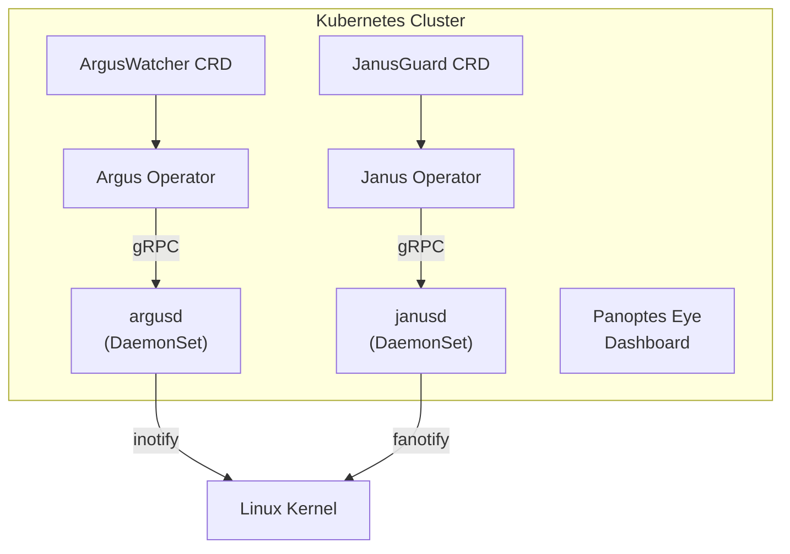

# Panoptes Suite

**Know when files change. Control who accesses them. In real-time. Across your cluster.**

[](LICENSE)
[](https://kubernetes.io)
[](https://github.com/como-technologies/panoptes/pkgs/container/charts%2Fpanoptes)
[](https://github.com/orgs/como-technologies/packages)

Containers shouldn't be touching sensitive files. Production workloads shouldn't be reading credentials off disk.
When they do, you need to know immediately -- not hours later in a log aggregator.

Panoptes provides kernel-level file integrity monitoring and access auditing for Kubernetes.
It detects file modifications, controls file access, and streams events in real-time using
Linux inotify and fanotify -- the same mechanisms the kernel itself uses.

## Philosophy

> **One tool, one job, done well.**

While enterprise security platforms pile on AI/ML detection, auto-remediation, and
thousand-rule policy engines, we take the opposite approach:

**Tried. Tested. Obvious. Explainable.**

- **Kernel-level detection**: Linux inotify and fanotify -- no heuristics, no guessing
- **Kubernetes-native**: CRDs, operators, label selectors -- not YAML soup or agent sprawl
- **Transparent**: Clear logs, obvious behavior -- you can explain any alert to an auditor
- **Composable**: Works with Prometheus, Grafana, Loki, your SIEM -- we don't replace them

We explicitly avoid: AI/ML black boxes, auto-remediation, complex policy engines, risk scores.

---

## Components

| Component | Purpose | When to Use |
|-----------|---------|-------------|
| **Argus** | File Integrity Monitoring (inotify) | Detect changes to config files, binaries, certs |
| **Janus** | File Access Auditing (fanotify) | Block/audit access to sensitive files |
| **Panoptes Eye** | Web Dashboard | Visualize events, manage CRDs, browse filesystems |

### When to Use Argus vs. Janus

| Scenario | Argus | Janus |
|----------|:-----:|:-----:|
| Compliance monitoring (PCI-DSS, SOC2, HIPAA) | ✓ | ✓ |
| Detect config drift | ✓ | |
| Detect persistence mechanisms (cron, ssh keys) | ✓ | |
| Block access to sensitive files | | ✓ |
| Runtime protection / enforcement | | ✓ |
| Audit who accessed what | | ✓ |

**Use both** for defense in depth: Argus detects changes, Janus controls access.

---

## Quick Start (5 minutes)

### Install with Helm

```bash
# Install Panoptes with PCI-DSS compliance monitoring
helm install panoptes oci://ghcr.io/como-technologies/charts/panoptes \
  --namespace panoptes-system --create-namespace \
  --set compliance.pciDss.enabled=true

# Verify
kubectl get pods -n panoptes-system
kubectl get arguswatchers,janusguards -n panoptes-system
```

### See it work

```bash
# Deploy a test pod and trigger a compliance violation
kubectl run payment-service --image=nginx:alpine \
  --labels="pci-dss/scope=in-scope" -n panoptes-system
kubectl wait --for=condition=Ready pod/payment-service -n panoptes-system --timeout=60s
kubectl exec payment-service -n panoptes-system -- sh -c "echo 'test' >> /etc/passwd"

# Check the detection
kubectl logs -n panoptes-system -l app.kubernetes.io/component=controller --tail=10
```

### Open the dashboard

```bash
kubectl port-forward -n panoptes-system svc/panoptes-eye 3000:80
# Open http://localhost:3000
```

**More deployment options:**
- [**Full Helm quickstart**](docs/HELM_QUICKSTART.md) -- All frameworks, standalone charts, configuration
- [**Demo scenarios**](examples/README.md) -- Copy-paste security demos (container breakout, credential theft, etc.)
- [Development (Kind)](docs/QUICK_START.md) -- Build from source with `./hack/local-deploy.sh all`
- [Spectro Cloud Palette](docs/SPECTRO_QUICK_START.md) -- Pack-based deployment
- [Platform guides](docs/guides/platforms/) -- EKS, GKE, AKS-specific instructions

---

## Your First Policies

### Monitor Critical Files (Argus)

```yaml
apiVersion: argus.como-technologies.io/v2
kind: ArgusWatcher
metadata:
  name: critical-files
spec:
  selector:
    matchLabels:
      app: my-app
  subjects:
    - paths: [/etc/passwd, /etc/shadow, /etc/sudoers]
      events: [modify, delete, attrib]
```

```bash
kubectl apply -f watcher.yaml
kubectl get aw  # Short name: aw
```

### Block Sensitive Access (Janus)

```yaml
apiVersion: janus.como-technologies.io/v2
kind: JanusGuard
metadata:
  name: block-secrets
spec:
  selector:
    matchLabels:
      app: my-app
  enforcing: true
  subjects:
    - deny: [/etc/shadow, /root/.ssh/**]
      allow: [/app/**, /tmp/**]
      events: [open, access]
      defaultResponse: deny
```

```bash
kubectl apply -f guard.yaml
kubectl get jg  # Short name: jg
```

---

## Architecture



**How it works:**
1. You create an `ArgusWatcher` or `JanusGuard` CR with label selectors
2. The operator finds matching pods and sends configs to node daemons via gRPC
3. Daemons register kernel watches on container filesystems via `/proc/{pid}/root`
4. Events stream back in real-time to the operator (and optionally to your dashboard/SIEM)

---

## What's Next?

<table>
<tr>
<td width="50%" valign="top">

### For Platform Operators

- [**Deploy to production**](docs/QUICK_START.md) -- Complete setup guide
- [**Kernel tuning**](docs/operations/kernel-tuning.md) -- inotify/fanotify limits
- [**Monitoring & alerting**](docs/guides/monitoring-alerting.md) -- Prometheus, Grafana
- [**Troubleshooting**](docs/guides/troubleshooting.md) -- Common issues

</td>
<td width="50%" valign="top">

### For Security Teams

- [**Compliance monitoring**](docs/guides/quickstart-compliance.md) -- PCI-DSS, HIPAA, SOC2
- [**Incident detection**](docs/guides/quickstart-incident-detection.md) -- Container breakouts
- [**What to monitor**](docs/guides/what-to-monitor.md) -- Recommended paths
- [**Threat model**](docs/security/threat-model.md) -- Attack vectors, mitigations

</td>
</tr>
<tr>
<td valign="top">

### For Application Owners

- [**API reference**](docs/api/) -- ArgusWatcher & JanusGuard specs
- [**Use case examples**](docs/guides/use-cases/) -- Real-world scenarios
- [**Platform hardening**](docs/guides/quickstart-platform-hardening.md) -- CIS benchmarks

</td>
<td valign="top">

### For Contributors

- [**Building from source**](docs/QUICK_START.md) -- Operators (Go), Daemons (Rust)
- [**Architecture docs**](docs/FUTURE_STATE.md) -- Design decisions, roadmap
- [**Security practices**](docs/security/rust-security-practices.md) -- Memory safety

</td>
</tr>
</table>

---

## Repository Structure

```
panoptes/
├── charts/              # Helm charts (OCI registry: ghcr.io/como-technologies/charts/)
│   ├── panoptes/        # Unified chart (operators + daemons + dashboard + compliance)
│   ├── panoptes-argus/  # Standalone Argus chart
│   └── panoptes-janus/  # Standalone Janus chart
├── deploy/              # Production manifests (kubectl apply -k deploy/)
├── docs/                # Comprehensive documentation
│   ├── adr/             # Architecture Decision Records
│   ├── guides/          # Use-case guides, platform guides
│   ├── security/        # Threat model, hardening
│   └── api/             # CRD API reference
├── examples/            # Copy-paste runnable security demo scenarios
├── operators/           # Kubernetes operators (Go)
│   ├── argus-operator/  # File integrity monitoring
│   └── janus-operator/  # File access auditing
├── daemons/             # Node daemons (Rust)
│   ├── argusd/          # inotify-based FIM
│   ├── janusd/          # fanotify-based audit
│   └── common/          # Shared utilities
├── ui/panoptes-eye/     # Web dashboard (Next.js)
├── proto/               # gRPC definitions
├── packs/               # Spectro Cloud Palette packs
└── hack/                # Development scripts
```

---

## Quick Reference

| Resource | Short Name | Daemon Port | API Group |
|----------|------------|-------------|-----------|
| ArgusWatcher | `aw` | 50051 | argus.como-technologies.io |
| JanusGuard | `jg` | 50052 | janus.como-technologies.io |

**Required kernel capabilities:**
- argusd: `SYS_PTRACE` (required), `DAC_READ_SEARCH` (optional)
- janusd: `SYS_ADMIN`, `SYS_PTRACE` (required), `AUDIT_WRITE` (optional)

**Requirements:** Kubernetes 1.28+, Linux kernel 5.x+, containerd or CRI-O

---

## Community

- **Issues**: [GitHub Issues](https://github.com/como-technologies/panoptes/issues)
- **Contributing**: See [CONTRIBUTING.md](CONTRIBUTING.md)
- **Roadmap**: See [ROADMAP.md](ROADMAP.md)
- **Governance**: See [GOVERNANCE.md](GOVERNANCE.md)
- **Architecture Decisions**: See [docs/adr/](docs/adr/)
- **Security**: Report vulnerabilities via [security policy](docs/security/vulnerability-response.md)
- **Adopters**: Using Panoptes? Add yourself to [ADOPTERS.md](ADOPTERS.md)

---

## License

Copyright 2026 Como Technologies, LTD. Licensed under [Apache 2.0](LICENSE).
