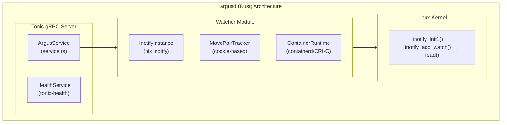

# argusd (Rust Implementation)

**Production-ready Rust implementation of the Argus file integrity monitoring daemon**

[](../../LICENSE)
[](https://www.rust-lang.org)

## Overview

This is a complete Rust implementation of argusd that provides:

- Memory safety guarantees through Rust's ownership system
- Direct inotify syscalls via the `nix` crate
- Async runtime with Tokio
- gRPC server with Tonic
- Container runtime integration (containerd, CRI-O)
- Move event pairing with cookie-based tracking
- Glob pattern filtering for ignore paths
- Metrics collection with atomic operations

## Status

**Production-Ready** - Feature-complete implementation matching the C daemon.
Fully tested with 54 unit tests and 12 integration tests.

## Architecture



## Project Structure

```
daemons/argusd/
├── Cargo.toml           # Rust dependencies
├── build.rs             # Proto compilation (tonic-build)
├── src/
│   ├── main.rs          # Entry point and CLI configuration
│   ├── service.rs       # gRPC service implementation
│   ├── notify.rs        # inotify wrapper, Watcher, MovePairTracker
│   ├── metrics.rs       # Atomic metrics collection
│   └── ebpf/            # eBPF userspace integration (feature-gated)
│       ├── mod.rs       # Re-exports from panoptes-common
│       └── events.rs    # EbpfFileEvent → proto conversion
├── ebpf/                # eBPF kernel programs (BPF target)
│   ├── Cargo.toml
│   └── src/main.rs      # LSM hooks (inode_create, inode_unlink, etc.)
├── tests/
│   └── integration_tests.rs
└── benches/
    └── event_processing.rs
```

## Features

| Feature | Status | Description |
|---------|--------|-------------|
| CreateWatch RPC | ✅ | Create inotify watches for container paths |
| DestroyWatch RPC | ✅ | Clean up watches and resources |
| GetWatchState RPC | ✅ | Streaming watch state updates with readiness |
| StreamEvents RPC | ✅ | Real-time file events with filtering |
| GetMetrics RPC | ✅ | Daemon-level metrics |
| Move event pairing | ✅ | Cookie-based pairing with 2ms timeout |
| Cache consistency | ✅ | Stale watch cleanup on reconnect |
| Overflow recovery | ✅ | Reinit with config preservation |
| Container runtime | ✅ | Auto-detection (containerd, CRI-O) |
| Glob filtering | ✅ | Ignore patterns like `*.tmp`, `node_modules/**` |
| Health checks | ✅ | gRPC health service (tonic-health) |
| Synchronous init | ✅ | Watches ready before RPC returns |
| **eBPF FIM** | ✅ | Process attribution via LSM hooks (optional feature) |

## Key Dependencies

| Crate | Version | Purpose |
|-------|---------|---------|
| `nix` | 0.29 | Direct inotify syscalls |
| `tokio` | 1.x | Async runtime |
| `tonic` | 0.12 | gRPC server |
| `tonic-health` | 0.12 | gRPC health checks |
| `prost` | 0.13 | Protobuf code generation |
| `tracing` | 0.1 | Structured JSON logging |
| `glob` | 0.3 | Pattern matching for ignore paths |
| `panoptes-common` | 0.1 | Shared utilities (container runtime, eBPF loader) |
| `panoptes-ebpf-types` | 0.1 | Shared eBPF types (no_std, via panoptes-common) |
| `aya-ebpf` | 0.1 | eBPF kernel program runtime (BPF target) |

## Building

### Prerequisites

- Rust 1.82+ (for dependency compatibility)
- Protobuf compiler (protoc)

### Build Commands

```bash
cd daemons/argusd

# Debug build
cargo build

# Release build (optimized)
cargo build --release

# Run tests
cargo test

# Run benchmarks
cargo bench

# Format and lint
cargo fmt --check && cargo clippy --all-targets --all-features
```

### Build Profile

The `Cargo.toml` includes an optimized release profile:

```toml
[profile.release]
lto = true           # Link-time optimization
codegen-units = 1    # Better optimization
strip = true         # Strip symbols
panic = "abort"      # No unwinding
```

## Configuration

| CLI Argument | Environment Variable | Default | Description |
|--------------|---------------------|---------|-------------|
| `--listen-addr` | `ARGUSD_LISTEN_ADDR` | `0.0.0.0:50051` | gRPC listen address |
| `--port` | `ARGUSD_PORT` | - | Port override (C daemon compatibility) |
| `--node-name` | `NODE_NAME` | `unknown` | Kubernetes node name |
| `--max-watches` | `ARGUSD_MAX_WATCHES` | `10000` | Maximum inotify watches |
| `--log-level` | `LOG_LEVEL` | `info` | Log level (trace/debug/info/warn/error) |

## Running

```bash
# Development
cargo run

# Production
./target/release/argusd

# With configuration
./target/release/argusd --port=50051 --node-name=worker-1 --log-level=debug

# Using environment variables
ARGUSD_PORT=50051 NODE_NAME=worker-1 LOG_LEVEL=debug ./target/release/argusd
```

## Docker Build

```bash
# Build from repo root (context needs proto/)
docker build -t argusd:latest -f daemons/argusd/Dockerfile .

# Run
docker run --privileged -p 50051:50051 argusd:latest
```

## Testing

```bash
# Unit tests
cargo test

# Integration tests (requires inotify)
cargo test --test integration_tests

# Specific test
cargo test test_file_creation_detection
```

### Test Coverage

| Module | Unit Tests | Integration Tests |
|--------|------------|-------------------|
| notify.rs | 35 | 6 |
| service.rs | 12 | 3 |
| metrics.rs | 7 | 1 |
| **Total** | **54** | **12** |

## Benchmarks

```bash
cargo bench
```

| Benchmark | Description |
|-----------|-------------|
| glob_matching | Pattern matching performance |
| event_filtering | Vec vs HashSet contains |
| move_pair_tracking | Cookie-based move pairing |
| metrics_collection | Atomic counter operations |
| path_processing | Path manipulation operations |

## Comparison with C Implementation

| Aspect | C Implementation | Rust Implementation |
|--------|------------------|---------------------|
| Memory safety | Manual | Guaranteed |
| Performance | Optimal | Near-optimal |
| Binary size | ~2MB | ~2MB |
| Image size | ~3MB (scratch) | ~50MB (debian-slim) |
| Dependencies | gRPC C++, spdlog | Tokio, Tonic |
| Build time | Fast (with cache) | Slower |
| Testing | GoogleTest | Rust built-in |

## eBPF-Based File Integrity Monitoring

For comprehensive eBPF documentation including architecture, kernel requirements, and troubleshooting, see **[`daemons/common/EBPF.md`](../common/EBPF.md)**.

### Argus-Specific LSM Hooks

| Hook | Event | Description |
|------|-------|-------------|
| `security_inode_create` | Create | File or directory created |
| `security_inode_unlink` | Delete | File deleted |
| `security_inode_rename` | Rename | File renamed or moved |
| `security_file_open` | OpenWrite | File opened for writing |

### Building with eBPF

```bash
cd daemons/argusd

# Build with eBPF feature
cargo build --release --features ebpf

# Build kernel programs
cd ebpf && cargo build --target bpfel-unknown-none
```

### Project Structure (eBPF)

```
daemons/argusd/
├── ebpf/                          # eBPF kernel programs (argusd-ebpf crate)
│   ├── Cargo.toml                 # Uses bpfel-unknown-none target
│   └── src/main.rs                # LSM hook implementations
│
└── src/ebpf/                      # Userspace integration
    ├── mod.rs                     # Re-exports from panoptes-common
    └── events.rs                  # EbpfFileEvent → argus.v2.FileEvent
```

Shared types and loader are in `panoptes-common` with the `ebpf` feature.

---

## Security Considerations

### Compliance Implications

For compliance frameworks that require knowing WHO accessed files (PCI-DSS 10.2.1, HIPAA,
SOC2), enable the eBPF feature or **use JanusGuard** for those paths.

| Use Case | Recommended Tool | Why |
|----------|------------------|-----|
| File integrity monitoring (detect changes) | ArgusWatcher | Detects modifications |
| FIM with process attribution | ArgusWatcher + eBPF | Full audit trail |
| Access auditing (who read the file) | JanusGuard | Captures process info |
| Access control (block unauthorized access) | JanusGuard | Can deny access |
| Configuration drift detection | ArgusWatcher | Detects config changes |
| Sensitive file protection | JanusGuard | Real-time blocking |

### Security Capabilities

Argus requires the following Linux capabilities:

| Capability | Purpose | Required |
|------------|---------|----------|
| `SYS_PTRACE` | Access container filesystems via `/proc/{pid}/root` | Yes |
| `DAC_READ_SEARCH` | Bypass file read permission checks | Optional |
| `BPF` | Load eBPF programs (with `ebpf` feature) | For eBPF |
| `PERFMON` | Attach to LSM hooks (with `ebpf` feature) | For eBPF |

**Note:** The DaemonSet uses `privileged: true` which includes all capabilities.
For production, consider using specific capabilities instead.

## Defensive Hardening

Argusd implements several defensive measures to protect against kernel interface
issues that could cause silent security monitoring failures.

### Resource Limit Checks

At startup, argusd verifies system resource limits are sufficient:

| Limit | Purpose | Check |
|-------|---------|-------|
| `RLIMIT_NOFILE` | File descriptor limit | Must exceed `max_watches + 1024` |
| `max_user_watches` | Per-user inotify watch limit | Warning if below `max_watches` |
| `max_queued_events` | Event queue size | Warning if below 32768 |

If limits are too low, the daemon exits with a clear error message explaining
how to adjust the limit. This prevents cryptic failures partway through operation.

**Fix insufficient limits:**

```bash
# File descriptor limit
ulimit -n 65536

# inotify watch limit (persistent)
echo "fs.inotify.max_user_watches=524288" | sudo tee -a /etc/sysctl.conf
sudo sysctl -p

# Event queue size (prevents overflow)
echo "fs.inotify.max_queued_events=65536" | sudo tee -a /etc/sysctl.conf
sudo sysctl -p
```

### Queue Overflow Handling

If inotify events arrive faster than argusd can process them, the kernel
drops events and sets `IN_Q_OVERFLOW`. Argusd detects this and:

1. Logs a warning with the `queue_overflows` metric
2. Reinitializes the inotify instance
3. Re-adds all watches from stored configuration

**Security implication:** Events during the overflow window are lost. Monitor
the `queue_overflows` metric and alert on non-zero values.

**Mitigation:**
- Increase `max_queued_events` via sysctl
- Reduce monitoring scope (fewer paths, more specific patterns)
- Ensure daemon has sufficient CPU resources

### Metrics for Security Monitoring

| Metric | Description | Alert Threshold |
|--------|-------------|-----------------|
| `queue_overflows` | Events dropped due to kernel queue overflow | > 0 |
| `errors_total` | Generic error counter | Rate > 1/min |
| `move_pairs_timeout` | Unpaired move events (possible attack) | Rate > 10/min |

**Prometheus alert example:**

```yaml
- alert: InotifyQueueOverflow
  expr: rate(argusd_queue_overflows_total[5m]) > 0
  annotations:
    summary: "inotify events are being dropped"
    runbook: "Increase max_queued_events or reduce monitoring scope"
```

### References

- `man 7 inotify` - inotify limits and queue overflow behavior
- `fs.inotify.*` sysctls - `/proc/sys/fs/inotify/`

## Kubernetes Deployment

The daemon is deployed as a DaemonSet. See `hack/argusd-daemonset.yaml`:

```yaml
args:
- --port=50051  # Works with both C and Rust
```

Both implementations accept the same `--port` argument for compatibility.

## License

Copyright 2026 Como Technologies, LTD

Licensed under the Apache License, Version 2.0. See [LICENSE](../../LICENSE) for details.
