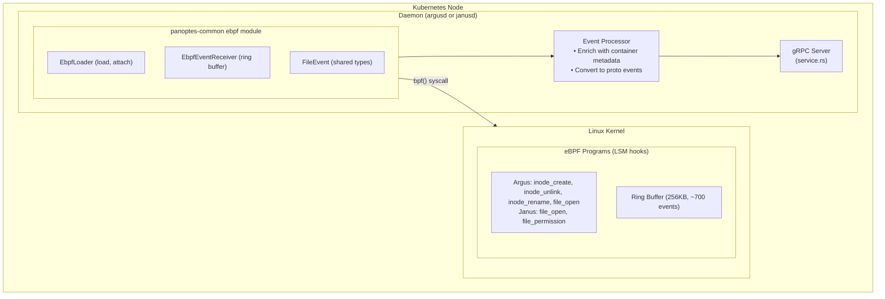
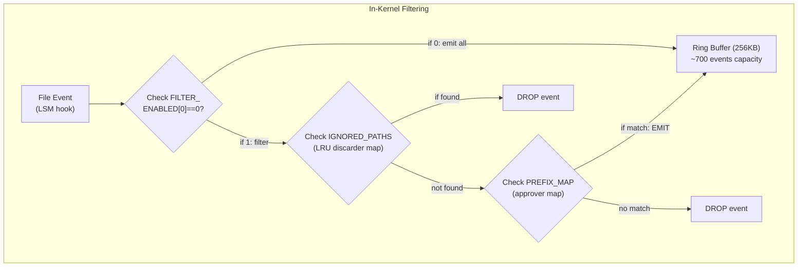

# eBPF Support for Panoptes Daemons

This document describes the shared eBPF infrastructure used by both Argus (FIM) and Janus (access auditing) daemons.

## Architecture Philosophy: UNIX Style

**One approach per binary. Build-time selection. No hybridization.**

| Mode | Build Command | Event Source | Process Info |
|------|---------------|--------------|--------------|
| Traditional | `cargo build` | inotify / fanotify | None (Argus) or /proc (Janus) |
| eBPF | `cargo build --features ebpf` | LSM hooks | Atomic kernel capture |

Choose the mode at build time. No runtime switching.

## Why eBPF?

eBPF mode provides significant advantages over traditional kernel APIs:

| Aspect | Traditional (inotify/fanotify) | eBPF (LSM hooks) |
|--------|-------------------------------|------------------|
| **Process PID** | None (Argus) / Direct (Janus) | Direct |
| **Process UID/GID/comm** | None / TOCTOU race | Atomic capture |
| **Container ID** | Requires /proc parsing | bpf_get_current_cgroup_id() |
| **Filtering** | Userspace | Kernel (90%+ reduction) |
| **Permission control** | fanotify only | LSM hooks (Janus eBPF) |
| **Kernel requirement** | 5.x | 5.8+ with BTF |

**When to use eBPF mode:**
- Need process attribution (PID, UID, comm, container ID)
- Kernel 5.8+ with BTF enabled
- Want kernel-side filtering for performance
- Need atomic process info (no TOCTOU race)

**When to use Traditional mode:**
- Older kernels (< 5.8) without BTF
- Simpler deployment (no eBPF toolchain required)
- Don't need process information (Argus)
- Already using fanotify's /proc lookups (Janus)

## Architecture



## Shared Infrastructure

All eBPF code is consolidated under `daemons/common/src/ebpf/`:

```
daemons/common/
├── Cargo.toml                       # panoptes-common (userspace, std)
└── src/
    ├── ebpf/                        # ALL eBPF-related code
    │   ├── mod.rs                   # Userspace: is_ebpf_supported(), re-exports
    │   ├── loader.rs                # Userspace: Generic EbpfLoader
    │   │
    │   ├── types/                   # panoptes-ebpf-types crate (no_std)
    │   │   ├── Cargo.toml           # Shared types for kernel↔userspace
    │   │   └── src/lib.rs
    │   │       ├── FileEvent        # C-repr struct
    │   │       ├── FileEventType    # Create, Modify, Delete, Access, etc.
    │   │       └── MAX_PATH_LEN     # Size constants
    │   │
    │   └── kernel/                  # panoptes-ebpf-kernel crate (no_std)
    │       ├── Cargo.toml           # Kernel helpers for eBPF programs
    │       └── src/
    │           ├── lib.rs           # Module exports
    │           ├── maps.rs          # define_filter_maps! macro
    │           ├── filtering.rs     # should_emit_event() logic
    │           └── helpers.rs       # populate_process_info(), submit_event()
    └── ...

daemons/argusd/ebpf/                 # argusd-ebpf crate (kernel programs)
└── src/main.rs                      # LSM hooks for FIM (uses ebpf/kernel)

daemons/janusd/ebpf/                 # janusd-ebpf crate (kernel programs)
└── src/main.rs                      # LSM hooks for auditing (uses ebpf/kernel)
```

### Crate Responsibilities

| Crate | Environment | Purpose |
|-------|-------------|---------|
| `panoptes-common` | Userspace (std) | eBPF loader, config types, daemon utilities |
| `panoptes-ebpf-types` | Both (no_std) | Shared types for kernel↔userspace communication |
| `panoptes-ebpf-kernel` | Kernel (no_std) | Maps, filtering, helpers for eBPF programs |
| `argusd-ebpf` | Kernel (no_std) | FIM LSM hooks (inode_create, unlink, rename) |
| `janusd-ebpf` | Kernel (no_std) | Audit LSM hooks (file_open, file_permission) |

## In-Kernel Filtering

We implement a two-stage filtering model that reduces ring buffer pressure by 90%+ in production:



### BPF Maps

| Map | Type | Key | Value | Purpose |
|-----|------|-----|-------|---------|
| EVENTS | RingBuf | - | FileEvent | Events to userspace |
| WATCHED_PREFIXES / GUARDED_PREFIXES | HashMap | [u8; 128] | u8 | Path prefixes to monitor (approvers) |
| IGNORED_PATHS | LruHashMap | [u8; 256] | u8 | Paths to ignore (discarders) |
| FILTER_ENABLED | HashMap | u32 | u32 | Global filter toggle (0=off, 1=on) |

## Why Aya?

[Aya](https://aya-rs.dev/) is a pure-Rust eBPF library chosen for:

| Criteria | Aya | libbpf-rs | BCC |
|----------|-----|-----------|-----|
| Pure Rust | ✅ | Partial (FFI) | No (Python/C++) |
| No runtime deps | ✅ | Needs libbpf.so | Needs LLVM/clang |
| CO-RE support | ✅ | ✅ | ✅ |
| Compile-time safety | ✅ | Partial | No |
| Async-friendly | ✅ | Manual | No |
| Community | Active | Active | Mature |

**CO-RE (Compile Once, Run Everywhere):** With BTF, eBPF programs compiled on one kernel version work on others without recompilation.

## Kernel Requirements

| Requirement | Minimum | Recommended | Check Command |
|-------------|---------|-------------|---------------|
| Kernel version | 5.7 | 5.15+ | `uname -r` |
| CONFIG_BPF_LSM | Yes | Yes | `grep BPF_LSM /boot/config-$(uname -r)` |
| CONFIG_DEBUG_INFO_BTF | Yes | Yes | `ls /sys/kernel/btf/vmlinux` |
| BTF vmlinux | Yes | Yes | `ls /sys/kernel/btf/vmlinux` |

**Why 5.7?** LSM BPF support was added in kernel 5.7. Earlier kernels can use kprobes as a fallback.

## Capability Requirements

| Capability | Purpose | Alternative |
|------------|---------|-------------|
| `CAP_BPF` | Load eBPF programs | `CAP_SYS_ADMIN` |
| `CAP_PERFMON` | Attach to LSM hooks | `CAP_SYS_ADMIN` |
| `CAP_SYS_PTRACE` | /proc access for container paths | Required |

In Kubernetes DaemonSets:

```yaml
securityContext:
  capabilities:
    add:
      - BPF
      - PERFMON
      - SYS_PTRACE
```

## FileEvent Structure

The shared event structure passed from kernel to userspace:

```rust
#[repr(C)]
pub struct FileEvent {
    pub event_type: u32,           // FileEventType enum
    pub pid: u32,                  // Process ID
    pub tgid: u32,                 // Thread group ID
    pub uid: u32,                  // User ID
    pub gid: u32,                  // Group ID
    pub _pad: u32,                 // Alignment padding
    pub timestamp_ns: u64,         // Kernel timestamp
    pub path: [u8; 256],           // File path (null-terminated)
    pub comm: [u8; 16],            // Process command (TASK_COMM_LEN)
    pub container_id: [u8; 64],    // Container ID from cgroup
}
// Total size: ~368 bytes (fits in eBPF 512-byte stack limit)
```

## FileEventType

Event types shared between daemons:

| Type | Value | Argus (FIM) | Janus (Audit) |
|------|-------|-------------|---------------|
| Create | 1 | ✅ | - |
| Modify | 2 | ✅ | - |
| Delete | 3 | ✅ | - |
| Rename | 4 | ✅ | - |
| OpenWrite | 5 | ✅ | ✅ |
| Attrib | 6 | ✅ | - |
| Access | 7 | - | ✅ |
| OpenRead | 8 | - | ✅ |

## Ring Buffer

Events flow from kernel to userspace via a BPF ring buffer:

- **Size:** 256KB
- **Capacity:** ~700 events before wraparound
- **Polling:** `tokio::task::spawn_blocking` with 10ms sleep
- **Overflow:** Events dropped if ring buffer full (logged)

## Deployment

### Build-Time Mode Selection

Mode is selected at build time, not runtime. This follows the UNIX philosophy of doing one thing well:

| Mode | Build Command | Cargo Feature | Dockerfile Arg |
|------|---------------|---------------|----------------|
| Traditional | `cargo build` | (none) | `ENABLE_EBPF=false` |
| eBPF | `cargo build --features ebpf` | `ebpf` | `ENABLE_EBPF=true` |

### Local Development

The deploy scripts use `EBPF_MODE` to select the build:

```bash
# Traditional mode (default) - inotify/fanotify
./hack/local-deploy.sh all

# eBPF mode - LSM hooks with full process attribution
EBPF_MODE=true ./hack/local-deploy.sh all

# WSL2 (requires custom kernel with BPF LSM support)
EBPF_MODE=true ./hack/local-wsl-deploy.sh all
```

### Docker Build

```bash
# Traditional mode (default)
docker build -f daemons/argusd/Dockerfile .

# eBPF mode
docker build --build-arg FEATURES=ebpf \
    -f daemons/argusd/Dockerfile .
```

### Kubernetes DaemonSet Configuration

**Traditional mode** (default capabilities):
```yaml
spec:
  containers:
  - name: argusd
    securityContext:
      capabilities:
        add:
          - SYS_PTRACE      # Required for /proc access
          - DAC_READ_SEARCH # Optional for broader file access
```

**eBPF mode** (additional capabilities):
```yaml
spec:
  containers:
  - name: argusd
    securityContext:
      capabilities:
        add:
          - BPF           # Required for eBPF program loading
          - PERFMON       # Required for LSM hook attachment
          - SYS_PTRACE    # Required for /proc access
          - SYS_ADMIN     # Fallback if BPF/PERFMON unavailable
```

## Building with eBPF

### Prerequisites

```bash
# Rust toolchain with BPF target
rustup target add bpfel-unknown-none

# Verify kernel support
cat /boot/config-$(uname -r) | grep -E "BPF_LSM|DEBUG_INFO_BTF"
ls /sys/kernel/btf/vmlinux
```

### Build Commands

```bash
# Build shared types
cd daemons/common/src/ebpf/types && cargo build

# Build panoptes-common with eBPF
cd daemons/common && cargo build --features ebpf

# Build argusd with eBPF
cd daemons/argusd && cargo build --features ebpf

# Build argusd kernel programs
cd daemons/argusd/ebpf && cargo build --target bpfel-unknown-none

# Build janusd with eBPF
cd daemons/janusd && cargo build --features ebpf

# Build janusd kernel programs
cd daemons/janusd/ebpf && cargo build --target bpfel-unknown-none
```

## Debugging

```bash
# Check if LSM BPF is enabled
cat /sys/kernel/security/lsm  # Should include "bpf"

# View loaded BPF programs
sudo bpftool prog list

# View BPF maps
sudo bpftool map list

# Trace BPF verifier errors
sudo cat /sys/kernel/debug/tracing/trace_pipe
```

## Troubleshooting

| Problem | Cause | Solution |
|---------|-------|----------|
| `EbpfError::NotSupported` | Kernel < 5.7 or no BTF | Upgrade kernel, enable CONFIG_DEBUG_INFO_BTF |
| `EbpfError::MissingCapabilities` | No CAP_BPF/PERFMON | Run as root or add capabilities |
| `EbpfError::Load` | Invalid bytecode | Rebuild eBPF crate, check bpf-linker |
| `EbpfError::Attach` | LSM not enabled | Add `lsm=bpf` to kernel cmdline |
| Ring buffer overflow | Too many events | Increase ring buffer size or add filtering |

## No Runtime Fallback

**Mode is determined at build time.** There is no runtime fallback:

| If you build with... | And kernel doesn't support eBPF... | Result |
|---------------------|-----------------------------------|--------|
| Traditional mode | N/A | Works (uses inotify/fanotify) |
| eBPF mode | Missing BTF or capabilities | **Daemon fails to start** |

**This is intentional.** The UNIX philosophy means:
- Deploy traditional binaries on older kernels
- Deploy eBPF binaries only on capable kernels
- Don't mix-and-match in a single binary

## Why Not Linux Audit?

The kernel audit subsystem was considered but **does not work in containers**. Audit watch rules cannot be added for `/proc/<pid>/root/*` paths - the kernel returns `EPERM`. This is a fundamental limitation.

## Reference Implementations

This eBPF infrastructure is inspired by:

- [Tetragon](https://tetragon.io/) - Cilium's eBPF security observability
- [Falco](https://falco.org/) - CNCF runtime security
