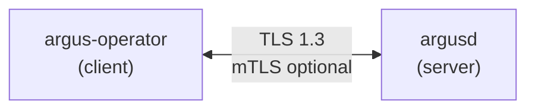
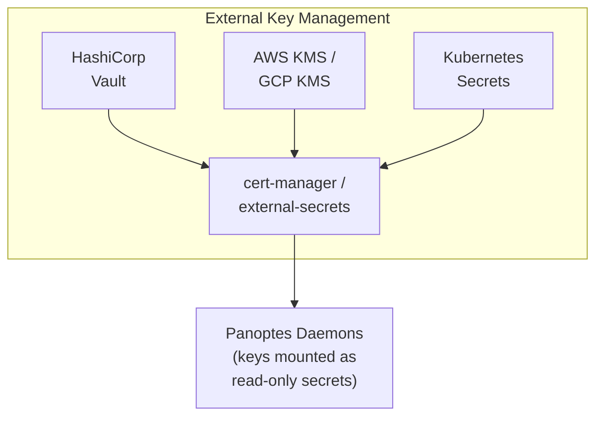

# Cryptographic Guarantees

> **Purpose:** Documents all cryptographic protections in Panoptes and how they ensure integrity, authenticity, and confidentiality.
> **Audience:** Security teams, compliance auditors, architects

---

## Overview

Panoptes uses multiple layers of cryptographic protection:

| Layer | Protection | Status |
|-------|------------|--------|
| Transport | TLS 1.3 for gRPC | Implemented |
| Events | SHA-256 checksums | Implemented |
| Events | Ed25519 signatures | Planned |
| Container | Image signing (cosign) | Planned |
| Dependencies | Crate verification | Implemented |

---

## Transport Security (TLS)

### Operator-Daemon Communication

All gRPC communication between operators and daemons uses TLS:



**Configuration:**

```yaml
# Operator configuration
grpc:
  tls:
    enabled: true
    certFile: /etc/panoptes/certs/tls.crt
    keyFile: /etc/panoptes/certs/tls.key
    caFile: /etc/panoptes/certs/ca.crt  # For mTLS
```

**What it protects against:**
- Eavesdropping on event stream
- Man-in-the-middle injection of false events
- Spoofing of daemon identity (with mTLS)

### Certificate Management

Certificates can be managed via:

1. **cert-manager** (recommended)
   ```yaml
   apiVersion: cert-manager.io/v1
   kind: Certificate
   metadata:
     name: panoptes-daemon-cert
   spec:
     secretName: panoptes-daemon-tls
     issuerRef:
       name: panoptes-ca-issuer
       kind: ClusterIssuer
     dnsNames:
       - argusd.panoptes-system.svc
   ```

2. **Manual certificates** for air-gapped environments

3. **SPIFFE/SPIRE** for workload identity

---

## Event Integrity

### Current: SHA-256 Checksums

Every file integrity event includes a SHA-256 hash of the file content:

```rust
// From daemons/argusd/src/integrity.rs
use sha2::{Sha256, Digest};

fn compute_checksum(path: &Path) -> Result<String, Error> {
    let content = std::fs::read(path)?;
    let hash = Sha256::digest(&content);
    Ok(hex::encode(hash))
}
```

**Event structure:**

```json
{
  "timestamp": "2026-01-21T12:00:00Z",
  "path": "/etc/passwd",
  "event_type": "modify",
  "checksum_before": "abc123...",
  "checksum_after": "def456...",
  "node": "worker-1",
  "container": "nginx-abc123"
}
```

**What it proves:**
- File content has changed
- Exact content of the file at event time

**What it does NOT prove:**
- Event was generated by legitimate daemon (needs signing)
- Event was not modified in transit (needs TLS or signing)

### Planned: Event Signing

Future releases will sign each event with Ed25519:

```rust
// Planned implementation
use ed25519_dalek::{Keypair, Signature, Signer};

struct SignedEvent {
    event: Event,
    signature: Signature,
    signer_id: String,  // Node identity
}

fn sign_event(event: &Event, keypair: &Keypair) -> SignedEvent {
    let serialized = serde_json::to_vec(event)?;
    let signature = keypair.sign(&serialized);
    SignedEvent {
        event: event.clone(),
        signature,
        signer_id: get_node_id(),
    }
}
```

**Benefits:**
- Non-repudiation: Daemon can prove it generated the event
- Tamper detection: Modified events fail verification
- Chain of custody: Can prove event originated from specific node

### Planned: Event Chaining

Blockchain-style linking for tamper-evident logs:

```rust
struct ChainedEvent {
    event: SignedEvent,
    sequence_number: u64,
    previous_hash: [u8; 32],  // SHA-256 of previous event
}
```

**Benefits:**
- Detects deleted events (gap in sequence)
- Detects reordered events (hash chain breaks)
- Provides cryptographic audit trail

---

## Container Image Security

### Image Signing with Sigstore/Cosign

Container images should be signed before deployment:

```bash
# Sign image during CI/CD
cosign sign --key cosign.key ghcr.io/como-technologies/argusd:v2.0.0

# Verify before deployment
cosign verify --key cosign.pub ghcr.io/como-technologies/argusd:v2.0.0
```

**Kubernetes verification:**

```yaml
apiVersion: policy.sigstore.dev/v1alpha1
kind: ClusterImagePolicy
metadata:
  name: require-panoptes-signature
spec:
  images:
    - glob: "ghcr.io/como-technologies/*"
  authorities:
    - keyless:
        url: https://fulcio.sigstore.dev
        identities:
          - issuer: https://token.actions.githubusercontent.com
            subject: https://github.com/como-technologies/panoptes/.github/workflows/release.yml@refs/tags/*
```

### SBOM (Software Bill of Materials)

Every release includes a cryptographically signed SBOM:

```bash
# Generate SBOM during build
syft ghcr.io/como-technologies/argusd:v2.0.0 -o spdx-json > sbom.json

# Sign SBOM
cosign attest --predicate sbom.json --type spdxjson \
  ghcr.io/como-technologies/argusd:v2.0.0

# Verify SBOM
cosign verify-attestation --type spdxjson \
  ghcr.io/como-technologies/argusd:v2.0.0
```

**Benefits:**
- Know exactly what's in the container
- Verify no unexpected dependencies
- Required for some compliance frameworks (EO 14028)

---

## Rust Memory Safety as a Guarantee

While not cryptography, Rust's compile-time guarantees provide strong security properties:

### What Rust Prevents

| Vulnerability | Rust Prevention | CVE Example Prevented |
|---------------|-----------------|----------------------|
| Buffer overflow | Bounds checking | CVE-2021-3156 (sudo) |
| Use-after-free | Ownership system | CVE-2021-22555 (netfilter) |
| Double-free | Single ownership | CVE-2020-29661 (kernel) |
| Null dereference | No null pointers | CVE-2022-0847 (dirty pipe) |
| Data races | Send/Sync traits | CVE-2022-0185 (kernel) |

### Verification

```bash
# Check for known vulnerable dependencies
cargo audit

# Count unsafe code usage
cargo geiger

# Verify no unsafe in application code (only deps)
cargo geiger --update-readme
```

**Current unsafe usage:**
- `0` lines of unsafe in Panoptes application code
- Unsafe only in dependencies (tokio, tonic, libc bindings)
- All unsafe in deps is audited and necessary for system calls

---

## Dependency Verification

### cargo-deny Configuration

```toml
# deny.toml
[advisories]
vulnerability = "deny"
unmaintained = "warn"

[sources]
unknown-registry = "deny"
unknown-git = "deny"
allow-registry = ["https://github.com/rust-lang/crates.io-index"]
# No git dependencies allowed - everything from crates.io

[licenses]
allow = ["MIT", "Apache-2.0", "BSD-2-Clause", "BSD-3-Clause", "ISC"]
copyleft = "deny"
```

### What This Verifies

1. **No known vulnerabilities** in any dependency
2. **No dependencies from unknown sources** (git repos, private registries)
3. **License compliance** (no copyleft in proprietary deployments)
4. **No duplicate versions** that could cause confusion

---

## Key Management

### Recommended Architecture



### Key Rotation

| Key Type | Rotation Frequency | Automated? |
|----------|-------------------|------------|
| TLS certificates | 90 days | Yes (cert-manager) |
| Event signing keys | 1 year | Manual |
| Image signing keys | 1 year | Manual |

---

## Compliance Mapping

| Requirement | Panoptes Implementation |
|-------------|------------------------|
| **NIST 800-53 SC-8** (Transmission Confidentiality) | TLS 1.3 for all gRPC |
| **NIST 800-53 SC-13** (Cryptographic Protection) | SHA-256, Ed25519 (planned) |
| **NIST 800-53 SI-7** (Software/Firmware Integrity) | Image signing, SBOM |
| **PCI-DSS 4.1** (Strong Cryptography) | TLS 1.3, no deprecated ciphers |
| **HIPAA 164.312(e)** (Transmission Security) | TLS for PHI in transit |
| **SOC 2 CC6.1** (Logical Access) | mTLS for daemon authentication |

---

## Verification Commands

```bash
# Verify TLS is enabled
kubectl exec -n panoptes-system deploy/argus-operator -- \
  grpcurl -plaintext localhost:50051 grpc.health.v1.Health/Check
# Should fail with "failed to connect" if TLS required

# Verify image signature
cosign verify ghcr.io/como-technologies/argusd:v2.0.0

# Check for vulnerable dependencies
cd daemons/argusd && cargo audit

# Verify SBOM
cosign verify-attestation --type spdxjson \
  ghcr.io/como-technologies/argusd:v2.0.0

# Check certificate expiry
kubectl get secret -n panoptes-system panoptes-daemon-tls \
  -o jsonpath='{.data.tls\.crt}' | base64 -d | \
  openssl x509 -noout -enddate
```

---

## Future Enhancements

1. **Hardware Security Modules (HSM)**
   - Store signing keys in HSM/TPM
   - PKCS#11 integration

2. **Remote Attestation**
   - Verify daemon is running expected code
   - TPM-based attestation

3. **Confidential Computing**
   - Run daemons in SGX/SEV enclaves
   - Protect against node-level compromise

4. **Post-Quantum Cryptography**
   - Prepare for quantum-resistant algorithms
   - NIST PQC standards when finalized
