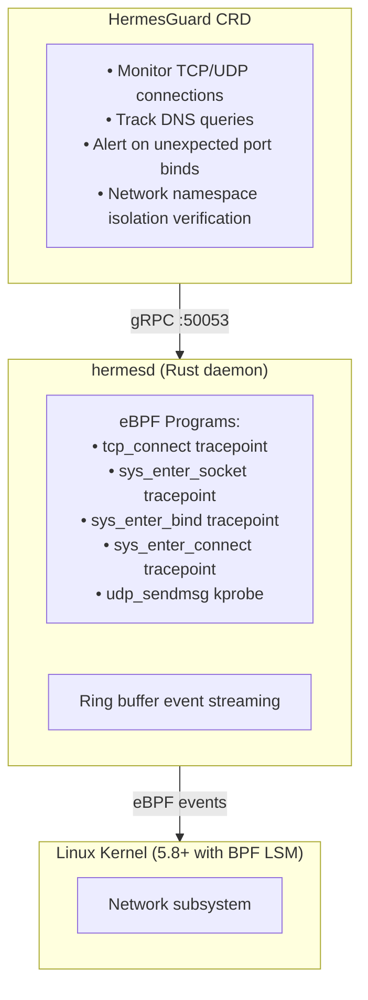

# Network Monitoring Roadmap

> **Status:** Future Work
> **Last Updated:** January 2026

This document explains the scope of Panoptes network monitoring capabilities, current limitations, and the roadmap for future network monitoring via a dedicated daemon.

---

## Current Scope: File Monitoring

Panoptes monitors **files** using Linux kernel interfaces:

| Daemon | Kernel Interface | What It Monitors |
|--------|------------------|------------------|
| Argus (argusd) | inotify | File creation, modification, deletion, moves, attribute changes |
| Janus (janusd) | fanotify | File access with allow/deny enforcement |

### What Panoptes CAN Detect (File-Based)

| Capability | How It Works | Limitation |
|------------|--------------|------------|
| Network tool execution | fanotify `FAN_OPEN_EXEC_PERM` on `/usr/bin/curl`, `/usr/bin/wget`, etc. | Only detects binary execution, not actual network activity |
| Unix socket file changes | inotify on `/var/run/*.sock`, `/run/containerd/containerd.sock` | Only file metadata, not socket traffic |
| Network namespace creation | inotify on `/var/run/netns/` | Only namespace setup, not activity |

### What Panoptes CANNOT Detect

| Capability | Why Not Possible |
|------------|------------------|
| TCP/UDP connections | Requires eBPF `tcp_connect` tracepoint or netfilter hooks |
| DNS queries | Requires packet inspection or socket syscall tracing |
| Network traffic content | Requires tc/XDP eBPF programs |
| Outbound data exfiltration | Network tool detection is bypassable (compiled-in clients, raw sockets) |

---

## UNIX Philosophy

Panoptes follows the UNIX principle: **"Do one thing and do it well."**

```
Argus  = File Integrity Monitoring    (inotify)
Janus  = File Access Control          (fanotify)
Hermes = Network Monitoring           (eBPF network hooks) [FUTURE]
```

Network monitoring is a fundamentally different paradigm from file monitoring:
- Different kernel interfaces (tc, XDP, socket BPF vs. inotify/fanotify)
- Different event volumes (potentially millions of packets/sec)
- Different retention/compliance requirements
- Different operational tuning

Mixing these concerns would violate separation of responsibilities and complicate both deployment and troubleshooting.

---

## Current Network Tool Auditing

The compliance templates include network tool execution auditing:

```yaml
# From deploy/compliance/base-security/janusguard.yaml
- deny:
    - /usr/bin/curl
    - /usr/bin/wget
    - /usr/bin/nc
    - /usr/bin/ncat
    - /usr/bin/netcat
    - /usr/bin/nmap
    - /usr/bin/socat
  events:
    - execute
  defaultResponse: audit  # Log only, do not block
  audit: true
  tags:
    severity: high
    category: suspicious-tools
```

### Limitations of This Approach

1. **Bypassable**: Processes can use compiled-in HTTP clients, raw sockets, or other network APIs
2. **Not real-time**: Detects execution, not the actual network connection
3. **No traffic visibility**: Cannot see what data is being sent/received
4. **Tool coverage**: Must enumerate every possible network tool binary

This approach is useful for detecting obvious attack patterns but is not comprehensive network monitoring.

---

## Future: Hermes Daemon

For true network monitoring, a dedicated daemon is planned:

### Hermes Architecture (Placeholder)



### Hermes Event Types (Planned)

| Event Type | Description | Use Case |
|------------|-------------|----------|
| `TCP_CONNECT` | Outbound TCP connection initiated | Detect C2 callbacks, data exfiltration |
| `TCP_ACCEPT` | Inbound TCP connection accepted | Detect unauthorized listeners |
| `UDP_SEND` | UDP datagram sent | DNS queries, UDP-based exfiltration |
| `BIND` | Process bound to port | Detect new services, backdoors |
| `DNS_QUERY` | DNS resolution (port 53 UDP) | Detect DNS tunneling, suspicious domains |

### Why Not Add This to Janus?

1. **Event volume**: Network events can be orders of magnitude higher than file events
2. **Different tuning**: Network monitoring may need sampling, file monitoring cannot
3. **Compliance mapping**: Network controls map to different requirements than FIM
4. **Operational isolation**: Network issues shouldn't impact file monitoring and vice versa
5. **Resource separation**: Different CPU/memory profiles

---

## Implementation Timeline

| Phase | Scope | Status |
|-------|-------|--------|
| **Current** | File monitoring (Argus/Janus) | Production |
| **Current** | Network tool execution auditing | Available (limited) |
| **Future** | Hermes daemon design | Not started |
| **Future** | Hermes implementation | Not started |

Hermes will be implemented when:
1. Customer demand justifies the investment
2. Compliance frameworks require network monitoring specifically
3. File monitoring is fully mature and stable

---

## Alternatives for Network Monitoring Today

Until Hermes is implemented, consider these alternatives:

| Tool | Use Case | Integration |
|------|----------|-------------|
| **Cilium** | Kubernetes-native network policy and observability | Works alongside Panoptes |
| **Falco** | Runtime security including network syscalls | Complementary to Panoptes FIM |
| **Tetragon** | eBPF-based network and process observability | Can fill network monitoring gap |
| **tcpdump/Wireshark** | Manual network capture and analysis | For incident investigation |

These tools can be deployed alongside Panoptes to provide network visibility while Panoptes handles file integrity and access control.

---

## References

- [Linux inotify(7)](https://man7.org/linux/man-pages/man7/inotify.7.html) - File notification
- [Linux fanotify(7)](https://man7.org/linux/man-pages/man7/fanotify.7.html) - File access notification
- [BPF tcp_connect tracepoint](https://www.kernel.org/doc/html/latest/bpf/bpf_prog_type.html) - TCP connection tracing
- [Cilium documentation](https://docs.cilium.io/) - Kubernetes network observability
- [Tetragon](https://tetragon.io/) - eBPF-based security observability
