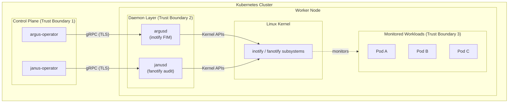

# Panoptes Threat Model

> **Purpose:** Analyze what happens when various Panoptes components or infrastructure are compromised.
> **Audience:** Security teams, incident responders, architects

---

## Overview

This document models attack scenarios against Panoptes and its monitored environment. For each scenario, we analyze:

1. **Attacker capabilities** - What can they do?
2. **Blast radius** - What is the impact?
3. **Detection** - Can Panoptes detect this?
4. **Mitigation** - How to prevent or limit damage?

---

## Trust Boundaries



---

## Scenario 1: Monitored Pod Compromised

**Attacker position:** Shell access inside a monitored container (e.g., via RCE vulnerability).

### What the Attacker Can Do

| Action | Detected by Panoptes? | Blocked? |
|--------|----------------------|----------|
| Read sensitive files (`/etc/shadow`) | Yes - JanusGuard event | If `enforcing: true` |
| Modify config files (`/etc/cron.d`) | Yes - ArgusWatcher event | No (audit-only) |
| Create persistence (cron, systemd) | Yes - ArgusWatcher event | No (audit-only) |
| Stage malware in `/tmp` | **No** - unmonitored by default | No |
| Access K8s secrets | Yes - JanusGuard event | Depends on `autoAllowOwner` |
| Container escape via socket | Yes - JanusGuard event | If CIS-K8s enforcing |

### Blast Radius

- **Contained:** Attacker is limited to the compromised container
- **Detection:** Most persistence/credential access attempts are logged
- **Lateral movement:** Depends on network policies and RBAC

### Mitigations

1. Enable `enforcing: true` on JanusGuards to block credential access
2. Monitor staging areas (`/tmp`, `/dev/shm`) - see remediation-plan.md
3. Use strict network policies to limit lateral movement
4. Apply pod security standards (restricted profile)

### Detection Indicators

```promql
# Alert on credential access attempts
increase(panoptes_janus_events_total{tags_category="credential-access"}[5m]) > 0

# Alert on persistence mechanisms
increase(panoptes_argus_events_total{tags_category="persistence"}[5m]) > 0
```

---

## Scenario 2: Node Compromised

**Attacker position:** Root access on a Kubernetes worker node.

### What the Attacker Can Do

| Action | Impact on Panoptes |
|--------|-------------------|
| Read daemon logs | See all monitored events (info disclosure) |
| Kill argusd/janusd | Stop monitoring on that node |
| Modify daemon config | Change what's monitored |
| Access all containers on node | Read any container filesystem |
| Intercept gRPC traffic | If TLS not enforced, see/modify events |
| Modify kernel parameters | Disable inotify/fanotify |

### Blast Radius

- **Node-scoped:** All containers on that node are exposed
- **Monitoring blind spot:** That node stops reporting if daemon killed
- **Other nodes:** Unaffected (daemons run independently)

### Detection

| Indicator | How to Detect |
|-----------|---------------|
| Daemon killed | Operator loses gRPC connection; Prometheus scrape fails |
| Events stop flowing | `panoptes_events_total` counter stops incrementing |
| TLS certificate issues | gRPC connection errors in operator logs |

### Mitigations

1. **Detect daemon death:** Alert on missing metrics/events from specific nodes
   ```yaml
   - alert: PanoptesDaemonDown
     expr: up{job="argusd"} == 0
     for: 1m
     annotations:
       summary: "Panoptes daemon down on {{ $labels.node }}"
   ```

2. **Remote logging:** Send events to external SIEM before local storage
   ```yaml
   observability:
     syslog:
       enabled: true
       server: "syslog.security.internal:514"
   ```

3. **Immutable infrastructure:** Use read-only host filesystems where possible

4. **Node integrity monitoring:** Use a separate tool to monitor node-level changes

5. **Mutual TLS:** Ensure operator-daemon communication uses mTLS

### What Panoptes Cannot Protect Against

With node-level root access, an attacker can:
- Disable all monitoring on that node
- Access raw container filesystems
- Potentially pivot to other nodes via the container runtime

**Key insight:** Panoptes detects threats within its trust boundary. Node compromise is outside that boundary.

---

## Scenario 3: Kubernetes Cluster Compromised

**Attacker position:** `cluster-admin` RBAC privileges.

### What the Attacker Can Do

| Action | Impact |
|--------|--------|
| Delete ArgusWatcher/JanusGuard CRDs | All monitoring stops |
| Delete Panoptes namespace | All components destroyed |
| Modify operator deployment | Inject malicious code |
| Access secrets in panoptes-system | Get TLS certs, configs |
| Evict all Panoptes pods | Temporary monitoring gap |

### Blast Radius

- **Cluster-wide:** All monitoring can be disabled
- **Evidence destruction:** If logs stored in-cluster, they're accessible
- **No detection:** Attacker controls everything

### Detection

By the time an attacker has cluster-admin, they can disable detection. The only defense is:

1. **External logging:** Events must be sent to an external system the attacker can't access
2. **External alerting:** Alerts for Panoptes component changes must come from outside the cluster
3. **Multi-cluster visibility:** Central collector detects when a cluster stops reporting

### Mitigations

1. **GitOps with drift detection:** Alert if Panoptes manifests change unexpectedly
2. **Admission control:** Prevent deletion of Panoptes resources
   ```yaml
   apiVersion: admissionregistration.k8s.io/v1
   kind: ValidatingWebhookConfiguration
   metadata:
     name: panoptes-protection
   webhooks:
     - name: protect-panoptes.como-technologies.io
       rules:
         - operations: ["DELETE"]
           resources: ["arguswatchers", "janusguards"]
       failurePolicy: Fail
   ```

3. **Break-glass procedures:** Require MFA for cluster-admin access

4. **External SIEM:** Stream all events to external system in real-time

---

## Scenario 4: Operator Compromised

**Attacker position:** Control over argus-operator or janus-operator pod.

### What the Attacker Can Do

| Action | Impact |
|--------|--------|
| Modify DaemonSet specs | Change daemon behavior |
| Delete DaemonSet | Stop all daemons |
| Read gRPC event stream | See all monitoring events |
| Inject false events | Poison monitoring data |
| Exfiltrate secrets | Access any secrets the operator can read |

### Blast Radius

- **Cluster-wide monitoring:** Operator controls all daemons in cluster
- **Data integrity:** Events cannot be trusted
- **Configuration:** Attacker controls what gets monitored

### Detection

| Indicator | How to Detect |
|-----------|---------------|
| Operator image changed | Image digest verification, GitOps drift |
| Unexpected API calls | Kubernetes audit logs |
| DaemonSet spec changed | GitOps drift detection |

### Mitigations

1. **Image signature verification:** Only allow signed operator images
2. **Minimal RBAC:** Operator only needs specific permissions
3. **Pod Security Standards:** Run operator with restricted profile
4. **Read-only DaemonSet:** Use `kubectl auth can-i --list` to audit operator permissions

---

## Scenario 5: Daemon Compromised

**Attacker position:** Control over argusd or janusd pod on a specific node.

### What the Attacker Can Do

| Action | Impact |
|--------|--------|
| Stop monitoring | That node becomes blind |
| Generate false events | Flood/DoS the operator |
| Read container filesystems | Has CAP_DAC_READ_SEARCH |
| Access `/proc/{pid}/root` | Has CAP_SYS_PTRACE |

### Blast Radius

- **Node-scoped:** Only affects containers on that node
- **Capability abuse:** Attacker inherits daemon's capabilities
- **Other daemons:** Unaffected (each node runs independently)

### What the Attacker CANNOT Do

Even with daemon compromise:
- Cannot write to host filesystem (read-only root, no CAP_DAC_OVERRIDE)
- Cannot load kernel modules (no CAP_SYS_MODULE)
- Cannot modify network (no CAP_NET_ADMIN)
- Cannot escape to other nodes (no network egress)

### Detection

| Indicator | How to Detect |
|-----------|---------------|
| Daemon image changed | Image verification |
| Abnormal events | Anomaly detection on event patterns |
| Operator connection issues | Connection health checks |

### Mitigations

1. **Image signature verification:** Only run signed daemon images
2. **Read-only container:** `readOnlyRootFilesystem: true`
3. **Network isolation:** NetworkPolicy prevents lateral movement
4. **Seccomp profile:** Restrict syscalls to monitoring operations only
5. **Runtime verification:** Use runtime security tools (Falco) to detect daemon tampering

---

## Scenario 6: Supply Chain Attack

**Attacker position:** Compromised build pipeline, dependency, or container registry.

### Attack Vectors

| Vector | Impact |
|--------|--------|
| Malicious Rust crate | Code execution in daemon |
| Compromised base image | Backdoor in container |
| Registry poisoning | Malicious image deployed |
| Build pipeline compromise | Inject code during build |

### Mitigations

1. **Dependency scanning:**
   - `cargo-audit` checks RustSec database
   - `cargo-deny` enforces allowed sources
   - Dependabot monitors for vulnerable dependencies

2. **SBOM generation:**
   - Generate Software Bill of Materials for every release
   - Customers can verify components

3. **Container image signing:**
   - Sign images with cosign/sigstore
   - Verify signatures before deployment

4. **Reproducible builds:**
   - Deterministic builds allow verification
   - Multiple independent builds should produce same hash

5. **Source verification:**
   - Only allow dependencies from crates.io
   - No git dependencies in `deny.toml`

### Detection

| Indicator | How to Detect |
|-----------|---------------|
| Image hash mismatch | Signature verification fails |
| Unknown dependencies | SBOM diff shows new components |
| CVE in dependency | Automated security scanning |

---

## Summary: Defense in Depth

| Layer | Protection |
|-------|------------|
| **Code** | Rust memory safety, cargo-audit, cargo-deny |
| **Build** | Signed images, SBOM, reproducible builds |
| **Deploy** | Image verification, GitOps, admission control |
| **Runtime** | Minimal capabilities, read-only FS, network policies |
| **Detect** | External logging, multi-cluster visibility, anomaly detection |
| **Respond** | Break-glass procedures, forensic preservation |

---

## Threat Matrix

| Scenario | Blast Radius | Detection | Mitigation Difficulty |
|----------|-------------|-----------|----------------------|
| Pod compromised | Container | Good | Low |
| Node compromised | Node | Medium | Medium |
| Cluster compromised | Cluster | Poor | High |
| Operator compromised | Cluster | Medium | Medium |
| Daemon compromised | Node | Medium | Low |
| Supply chain | Cluster | Medium | High |

---

## Recommendations

### Must Have (Before Production)

1. Enable external logging (SIEM/syslog)
2. Deploy network policies for Panoptes components
3. Verify container images are signed
4. Set up alerts for daemon health
5. Enable `enforcing: true` for critical rules

### Should Have (Within 30 Days)

1. GitOps with drift detection for Panoptes manifests
2. Custom seccomp profiles for daemons
3. Multi-cluster visibility dashboard
4. Incident response runbooks for each scenario

### Nice to Have (Future)

1. Admission webhook to prevent Panoptes deletion
2. eBPF-based monitoring (when kernel supports it)
3. Automated forensic preservation on critical events
4. Chaos engineering tests for monitoring resilience
