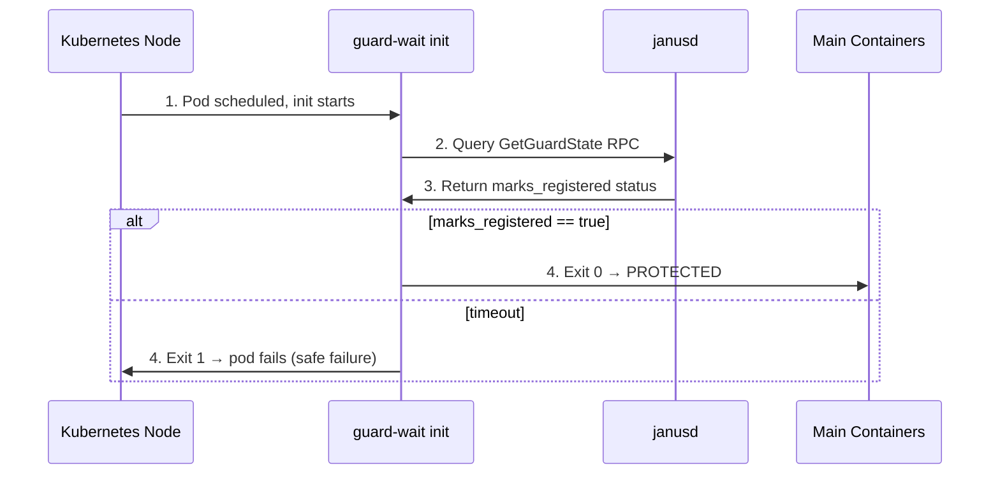

# guard-wait

**Rust init container that waits for JanusGuard readiness before pod startup**

## Overview

This tool is used as a Kubernetes init container to ensure JanusGuard has registered
fanotify marks before the main application containers start. This eliminates the race
condition where file access could occur before protection is active.

## How It Works



## Usage

### CLI Arguments

```bash
guard-wait \
  --guard-name my-guard \
  --namespace default \
  --pod-name my-pod-xyz \
  --janusd-address http://janusd.panoptes-system:50052 \
  --max-wait-secs 30 \
  --poll-interval-ms 500
```

### Environment Variables

All arguments can be set via environment variables:

| Variable | Description | Default |
|----------|-------------|---------|
| `GUARD_NAME` | Name of the JanusGuard resource | (required) |
| `NAMESPACE` | Kubernetes namespace | (required) |
| `POD_NAME` | Name of the pod being guarded | (required) |
| `JANUSD_ADDRESS` | janusd gRPC address | `http://janusd.panoptes-system:50052` |
| `MAX_WAIT_SECS` | Timeout in seconds | `30` |
| `POLL_INTERVAL_MS` | Poll interval in milliseconds | `500` |
| `VERBOSE` | Enable debug logging | `false` |

## Kubernetes Deployment

The guard-wait container is automatically injected by the Janus operator's mutating
webhook for pods that match a JanusGuard selector.

### Manual Init Container Example

```yaml
apiVersion: v1
kind: Pod
metadata:
  name: my-app
  namespace: default
spec:
  initContainers:
    - name: wait-for-guard
      image: panoptes/guard-wait:latest
      env:
        - name: GUARD_NAME
          value: "my-janusguard"
        - name: NAMESPACE
          valueFrom:
            fieldRef:
              fieldPath: metadata.namespace
        - name: POD_NAME
          valueFrom:
            fieldRef:
              fieldPath: metadata.name
  containers:
    - name: app
      image: my-app:latest
```

## Building

```bash
cd tools/guard-wait

# Debug build
cargo build

# Release build (optimized, ~2MB)
cargo build --release

# Run tests
cargo test
```

## Docker Image

```bash
# Build from repo root
docker build -t panoptes/guard-wait:latest -f tools/guard-wait/Dockerfile .

# Image size: ~5MB (static musl binary on scratch)
```

## Exit Codes

| Code | Meaning |
|------|---------|
| 0 | Guard is ready, pod can start safely |
| 1 | Timeout or error, pod should not start unprotected |

## Security

- Runs as non-root user (UID 1000)
- Minimal scratch image with no shell
- Only requires network access to janusd service
- No privileged capabilities required

## License

Copyright 2026 Como Technologies, LTD

Licensed under the Apache License, Version 2.0.
