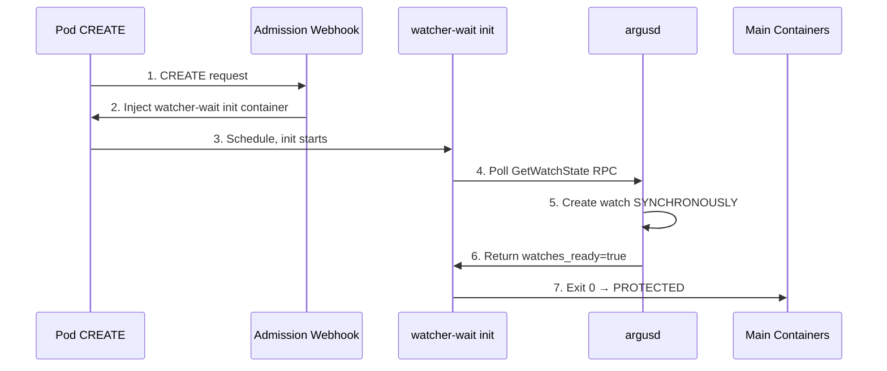

# watcher-wait

**Init container that waits for ArgusWatcher readiness before allowing pod startup**

## Overview

This tool is part of the ArgusWatcher hardening pattern. It eliminates the race condition where file modification could occur before inotify protection is active.

## Architecture



**Defense layers:**
- Synchronous watch init (Phase 1)
- Readiness fields in proto (Phase 2)
- Webhook + init container (Phase 3)

## Usage

### Command Line

```bash
watcher-wait --watcher-name my-watcher --namespace default --pod-name my-pod
```

### Environment Variables

All CLI arguments can be set via environment variables:

| Variable | Description | Default |
|----------|-------------|---------|
| `WATCHER_NAME` | Name of the ArgusWatcher resource | Required |
| `NAMESPACE` | Kubernetes namespace | Required |
| `POD_NAME` | Name of the pod being watched | Required |
| `ARGUSD_ADDRESS` | Address of argusd gRPC service | `http://argusd.panoptes-system:50051` |
| `MAX_WAIT_SECS` | Maximum wait time in seconds | `30` |
| `POLL_INTERVAL_MS` | Poll interval in milliseconds | `500` |
| `VERBOSE` | Enable verbose logging | `false` |

## Building

### From Source

```bash
cd tools/watcher-wait
cargo build --release
```

### Docker Image

```bash
# From repo root
docker build -t panoptes/watcher-wait:latest -f tools/watcher-wait/Dockerfile .
```

The resulting image is ~5MB (static musl binary on scratch).

## How It Works

1. **Connect to argusd** - Establishes gRPC connection to the argusd service
2. **Poll GetWatchState** - Repeatedly queries watch state for the target pod
3. **Check watches_ready** - Waits until `watches_ready=true` in the response
4. **Exit 0 or timeout** - Exits successfully when ready, or exits 1 on timeout

## Kubernetes Integration

The watcher-wait init container is automatically injected by the `argus-operator` webhook when:
1. The namespace has the label `argus.panoptes.io/watcher-injection: enabled`
2. A pod matches an ArgusWatcher selector
3. The pod doesn't have `argus.panoptes.io/inject: "false"` annotation

### Manual Injection (for testing)

```yaml
apiVersion: v1
kind: Pod
metadata:
  name: test-pod
spec:
  initContainers:
  - name: wait-for-watcher
    image: panoptes/watcher-wait:latest
    env:
    - name: WATCHER_NAME
      value: "my-watcher"
    - name: NAMESPACE
      valueFrom:
        fieldRef:
          fieldPath: metadata.namespace
    - name: POD_NAME
      valueFrom:
        fieldRef:
          fieldPath: metadata.name
    - name: ARGUSD_ADDRESS
      value: "http://argusd.panoptes-system:50051"
    - name: MAX_WAIT_SECS
      value: "30"
  containers:
  - name: app
    image: nginx
```

## Troubleshooting

### Init container times out

Possible causes:
- `argusd` is not running on the node
- `ArgusWatcher` resource is misconfigured
- Container runtime issues preventing PID resolution
- Network policy blocking gRPC communication

Check argusd logs:
```bash
kubectl logs -n panoptes-system daemonset/argusd
```

Check watcher-wait logs:
```bash
kubectl logs <pod-name> -c wait-for-watcher
```

## License

Copyright 2026 Como Technologies, LTD

Licensed under the Apache License, Version 2.0.
