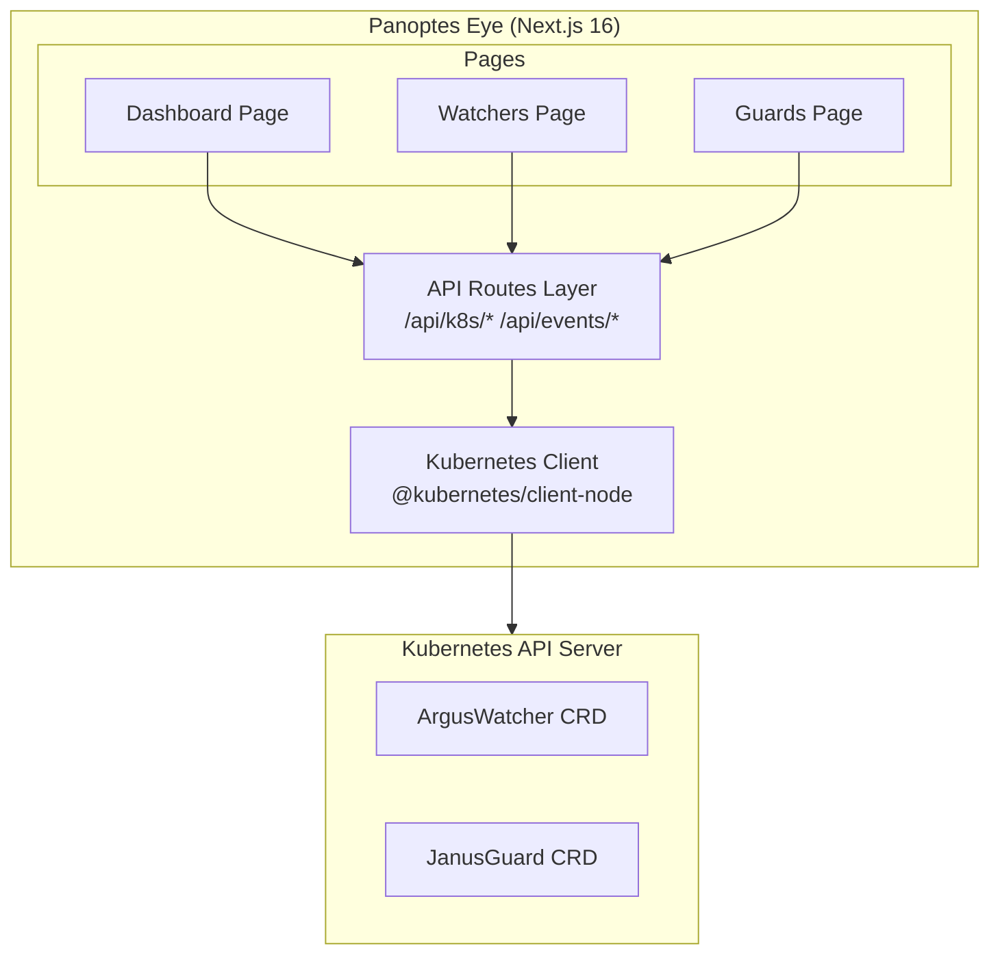

# Panoptes Eye

**All-seeing Kubernetes security monitoring dashboard**

Panoptes Eye is the unified web interface for the Panoptes security suite, providing real-time monitoring and management of Argus (File Integrity Monitoring) and Janus (File Access Auditing).

## Features

- **Dashboard Overview**: Real-time security metrics and event summaries
- **ArgusWatcher Management**: Create, edit, pause, and delete file integrity watchers
- **JanusGuard Management**: Configure file access policies with allow/deny rules
- **Real-time Events**: Live event stream with filtering and search
- **File Explorer**: Interactive filesystem browser for container contents
- **Visual Config Builder**: Drag-and-drop interface for creating watcher configurations

## Technology Stack

| Component | Technology |
|-----------|------------|
| Framework | Next.js 16 (App Router) |
| React | 19+ |
| State Management | TanStack Query 5 + Zustand 5 |
| Styling | Tailwind CSS 4 |
| K8s Client | @kubernetes/client-node |
| Virtualization | @tanstack/react-virtual |

## Quick Start

### Prerequisites

- Node.js 20+
- npm 10+
- Access to a Kubernetes cluster with Panoptes installed

### Development

```bash
# Install dependencies
npm install

# Start development server
npm run dev

# Open http://localhost:3000
```

### Production Build

```bash
# Build for production
npm run build

# Start production server
npm start
```

### Docker

```bash
# Build image
docker build -t panoptes-eye:latest .

# Run container
docker run -p 3000:3000 panoptes-eye:latest
```

## Kubernetes Deployment

```yaml
apiVersion: apps/v1
kind: Deployment
metadata:
  name: panoptes-eye
  namespace: panoptes-system
spec:
  replicas: 1
  selector:
    matchLabels:
      app: panoptes-eye
  template:
    metadata:
      labels:
        app: panoptes-eye
    spec:
      serviceAccountName: panoptes-eye
      containers:
        - name: panoptes-eye
          image: gcr.io/spectro-images/panoptes-eye:1.0.0
          ports:
            - containerPort: 3000
          env:
            - name: KUBERNETES_SERVICE_HOST
              value: kubernetes.default.svc
          resources:
            requests:
              cpu: 100m
              memory: 128Mi
            limits:
              cpu: 500m
              memory: 256Mi
---
apiVersion: v1
kind: Service
metadata:
  name: panoptes-eye
  namespace: panoptes-system
spec:
  type: ClusterIP
  ports:
    - port: 80
      targetPort: 3000
  selector:
    app: panoptes-eye
```

## Configuration

### Environment Variables

| Variable | Description | Default |
|----------|-------------|---------|
| `KUBERNETES_SERVICE_HOST` | K8s API server host | Auto-detected in-cluster |
| `NEXT_PUBLIC_REFRESH_INTERVAL` | Event refresh interval (ms) | `30000` |
| `NEXT_PUBLIC_MAX_EVENTS` | Max events to display | `100` |

## Architecture



## RBAC Requirements

The service account requires the following permissions:

```yaml
apiVersion: rbac.authorization.k8s.io/v1
kind: ClusterRole
metadata:
  name: panoptes-eye
rules:
  - apiGroups: ["argus.como-technologies.io"]
    resources: ["arguswatchers"]
    verbs: ["get", "list", "watch", "create", "update", "patch", "delete"]
  - apiGroups: ["janus.como-technologies.io"]
    resources: ["janusguards"]
    verbs: ["get", "list", "watch", "create", "update", "patch", "delete"]
  - apiGroups: [""]
    resources: ["pods"]
    verbs: ["get", "list", "watch"]
  - apiGroups: [""]
    resources: ["namespaces"]
    verbs: ["get", "list"]
```

## License

Copyright 2026 Como Technologies, LTD

Licensed under the Apache License, Version 2.0.
